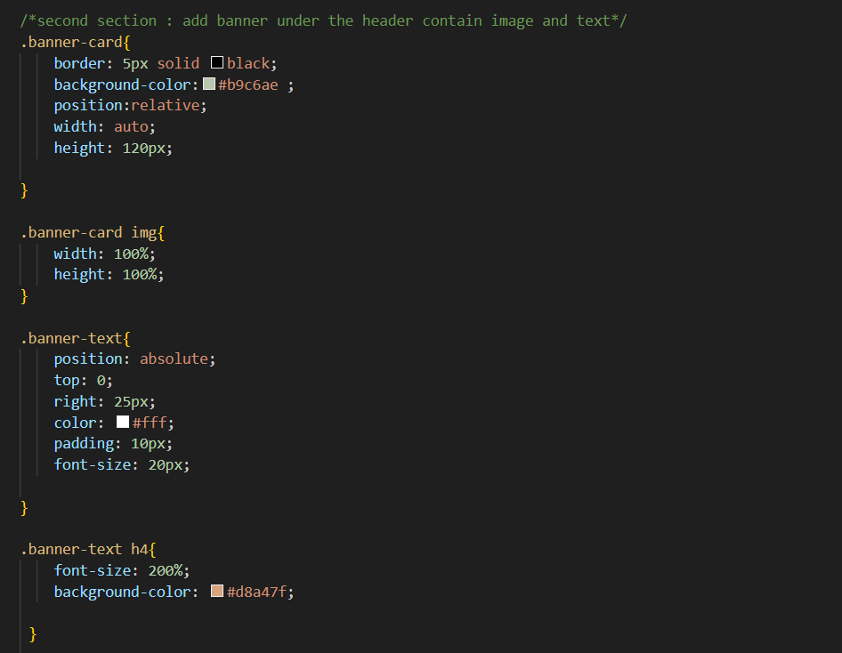

# Portfolio-CS

# Ahmed AlSamarrie-Protfolio

## Description

- What was your motivation? This project was very challenge and difficult because the CSS Code wasn't easy to understand, but I study a lot so I learn and practice how to modify HTML, CSS and improve the quality for website 
- Why did you build this project? I build this project for showing my work experience and background in Computer Science so it will be easy for company to know me closely and show my work.
- What problem does it solve?
1- I solved many problems like: I split the webpage to many sections and locate each section in the right location
2- I used semantic HTML elements
3- I add menu and my name in the header, the menu has four items "about me, Work, Contact Me, resume", each one I connect to the part belong to it   
4- in the work section I add five images with special design using grid-elements-area on CSS code, each image has mouse hover and I link it to the about me section area, one of the image has bigger size than other. 
5- I fix the CSS code inside my webpage if the screen size was under 768px so it can work with small screen

- What did you learn? I learn a lot about HTML and CSS attribute and how to do many things for margin ,boarding, padding, CSS selectors, grid-elements and HTML tags, 

## Installation

N/A

## Usage
when open the webpage, there is a menu on the right side and when you click any one goes directly to the information details for it 
I include pictures to show how I built the webpage using HTML and CSS to make page works better with different screen size

image 1: make fontfamily and color as a root

image 2: header code 

image 3: make a banner with text on it 

image 4: make main tage two columns to organize the section tage

image 5: make 5 image inside the section using grid-element-area

image 6: footer area and contact me information

image 7: how to use mouse hover in css 

image 8: code for how make small screen work

image 9: 

image 10: 

image 11: 

image 12:

image 13: 

image 14: 

image 15: from image 9-15 shows my webpage full screen and small screen

## Credits

Thank you for tips and sugestion from Bootcamp instructors and classmates, I hava used https://www.w3schools.com/ , https://stackoverflow.com/ and https://developer.mozilla.org/en-US/docs/Web/CSS/grid-template to reserch information 

## License

Please refer to the LICENSE in the repo.